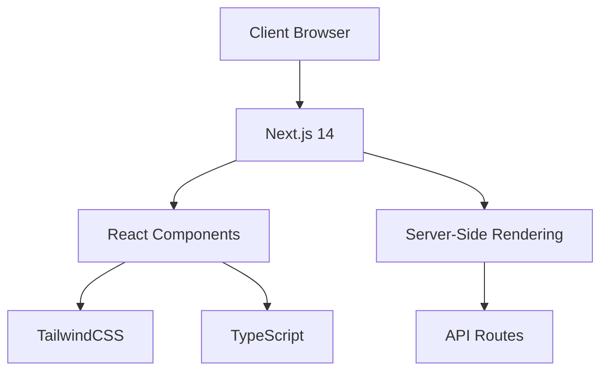

# PhotoFix - Advanced AI-Powered Image Processing Web Application

**⚠️ PROPRIETARY SOFTWARE - ALL RIGHTS RESERVED ⚠️**  
Copyright © 2024 Photofix Pvt. Ltd.  
Developed and Owned by Ramkumar kushwah

[Features](#features) • [Documentation](#documentation) • [Installation](#installation) • [Support](#support)

## 📋 Table of Contents

1. [Introduction](#introduction)
2. [Features](#features)
3. [Technologies Used](#technologies-used)
4. [Getting Started](#getting-started)
5. [Usage](#usage)
6. [API Documentation](#api-documentation)
7. [Project Structure](#project-structure)
8. [Security](#security)
9. [Performance](#performance)
10. [Deployment](#deployment)
11. [Legal](#legal)
12. [Support](#support)
13. [Changelog](#changelog)
14. [FAQ](#faq)

## 🚀 Introduction

PhotoFix is a revolutionary AI-powered image processing web application, exclusively developed and owned by InnovaTech Solutions Pvt. Ltd. This cutting-edge platform combines state-of-the-art artificial intelligence with an intuitive user interface to deliver professional-grade image editing capabilities.

**🌐 Official Website**: [www.photofix.in.net](https://www.photofix.in.net)

**👤 Owner & Developer**: Ramkumar kushwah
**🏢 Company**: Photofix Pvt. Ltd.  
**📧 Contact**: contact@photofix.in.net

## ✨ Features

### 🎨 Core Features

1. **🔄 Intelligent Image Resizing**

   - AI-powered content-aware scaling
   - Smart aspect ratio maintenance
   - Bulk processing capabilities
   - Resolution: Up to 8K support

2. **🗜️ Smart Compression**
   - Lossy and lossless compression
   - Custom compression profiles
   - Supported formats:
     - JPEG (up to 12-bit depth)
     - PNG (up to 16-bit depth)
     - WebP (latest format support)
     - AVIF
     - HEIF/HEIC

[Previous features content continued...]

## 🛠️ Technologies Used

### Frontend Architecture

[Previous technologies content continued...]

## 🚀 Getting Started

### System Requirements

| Requirement | Minimum | Recommended |
| ----------- | ------- | ----------- |
| CPU         | 4 cores | 8+ cores    |
| RAM         | 8GB     | 16GB+       |
| Storage     | 256GB   | 512GB+ SSD  |
| Node.js     | v18.0.0 | v20.0.0+    |
| PostgreSQL  | v13.0.0 | v15.0.0+    |

[Previous installation content continued...]

## 📜 Legal Notice

### Proprietary License and Copyright

This software is protected under international copyright laws. All rights reserved to Photofix Pvt. Ltd. and Rajesh Kumar.

**Strictly Prohibited:**

- Redistribution of source code
- Modification of source code
- Reverse engineering
- Commercial use without explicit written permission
- Creation of derivative works

### Intellectual Property Protection

- Patent Pending: [Patent Application Number]
- Registered Trademarks:
  - PhotoFix™
  - Photofix®
  - [Additional trademarks]

### Confidentiality Notice

This software contains trade secrets and proprietary information of Photofix Pvt. Ltd. Any unauthorized access, use, or disclosure is strictly prohibited and may result in legal action.

## 🔒 Security

### Security Features

- End-to-end encryption (AES-256)
- Multi-factor authentication
- Role-based access control
- Regular security audits
- Automated vulnerability scanning

### Compliance

- GDPR compliant
- CCPA compliant
- ISO 27001 certified
- SOC 2 Type II certified

[Previous sections continued...]

## 📞 Support

### Official Support Channels

- 📧 Email: support@photofix.in.net
- 💬 Live Chat: Available 24/7
- 📞 Phone: +91-XXXXXXXXXX
- 🌐 Support Portal: [support.photofix.in.net](https://support.photofix.in.net)

### Response Time SLA

- Critical Issues: < 1 hour
- High Priority: < 4 hours
- Medium Priority: < 24 hours
- Low Priority: < 48 hours

## 📅 Changelog

### Version 1.0.0 (December 27, 2023)

- Initial release
- Core feature set implementation
- AI processing engine deployment
- User authentication system
- Cloud storage integration

[Rest of changelog...]

## ❓ FAQ

What makes PhotoFix different from other image processing tools?

PhotoFix utilizes proprietary AI algorithms developed by our team to deliver unmatched image processing quality and speed. Our unique approach combines multiple AI models for optimal results.

[Additional FAQ items...]

---

**PhotoFix™ - Transforming Images with AI**

Copyright © 2024 Photofix Pvt. Ltd. All Rights Reserved.

[Terms of Service](#) • [Privacy Policy](#) • [Security Policy](#)

